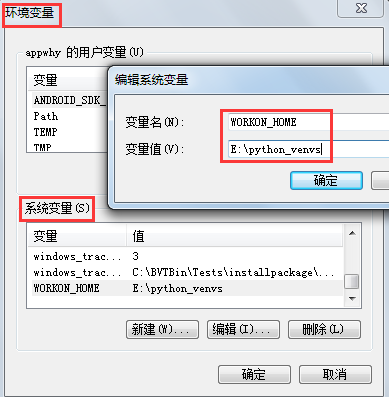

# python环境

[TOC]

<!-- toc -->

---

## python编辑器

在windows上，安装python后会自带IDLE编辑器，能用，但一般般。

集成开发一般用PyCharm，功能十分强大。

## python交互

### python

最简单的方式是直接执行python命令，会启动一个python命令行，可以执行相关代码。但是该方式操作有些不方便。

### ipython

功能介绍：

* Tab补全

* func?：快速查询文档，相当于`help(func)`。

* !shell_cmd：在shell命令前加上感叹号，直接执行shell命令，无需退出ipython。还可以赋值

  ```python
  a = !pwd                                                             
  # Out[8]: ['/root']
  
  type(a)
  # Out[10]: IPython.utils.text.SList
  ```

  

魔术方法（以%开头）：

* `%run python_file_path`：运行py文件。
* `%time func()`：查看func函数的运行时间。
* `%lsmagic`：列出所有魔术方法。


### jupyter

jupyter是一种交互式计算和开发环境的笔记，支持多语言，输出图形、音频、视频等功能。

安装：

```bash
pip3 install jupyter
```

启动：

```bash
jupyter notebook  # 启动一个web服务，用于交互。是基于ipython的
```


#### 配置多个内核

一般情况下，我安装了jupyter之后，只有一个python环境。比如，我是使用python3启动的jupyter notebook，我就只能使用python3。但我想使用python2怎么办呢？使用如下方法：

首先，要有python2的环境，假设`python2`启动的是python2相关的环境。

```bash
python2 -m pip install ipykernel   # 安装 IPython Kernel for Jupyter
python2 -m ipykernel install       # 将该python2的ipython内核添加进jupyter配置中
```

此时就能使用python2和python3两个环境了。

查看jupyter的ipython内核：

```bash
jupyter kernelspec list

# 输出
Available kernels:
  python3    C:\ProgramData\Anaconda3\lib\site-packages\ipykernel\resources
  python2    C:\ProgramData\jupyter\kernels\python2
  

# 列出jupyter的设置、数据目录
jupyter --paths 
```


有时为避免冲突，需要指定唯一的名称

```bash
python -m ipykernel install --name myenv --display-name 'py27"
```

  --name 是给jupyter 启动Kernel 使用（是`jupyter kernelspec list`显示在前面的name，如果指定的name已存在则会覆盖。--display-name 是为Jupyter notebook 菜单显示。


#### jupyter扩展

安装nbextensions：

```bash
pip install jupyter_contrib_nbextensions
jupyter contrib nbextension install --user

# 安装之后还需要启动扩展
jupyter nbextensions_configurator enable --user
```

--user表示将扩展安装到当前用户的配置文件夹下。

然后重启jupyter，在弹出的主页面里，能看到增加了一个Nbextensions标签页，在这个页面里，可以勾选相关扩展从而启动扩展。

常用扩展：

* Hinterland：每敲完一个键，就出现下拉菜单，可以直接选中你需要的词汇。
* Snippets：在工具栏里加了一个下拉菜单，可以非常方便的插入代码段（预先编写好的，类似模板）。
* Autopep8：使python代码符合pep8规范，需要先安装依赖`pip install autopep8`。

#### 搭建 jupyter notebook 服务

首先在linux上安装好python及相应的包，然后进行下面的操作。

编辑配置文件：/root/.jupyter/jupyter_notebook_config：（当前用户关于jupyter的配置文件）

如果没有，就先生成：

```bash
jupyter notebook --generate-config
```

修改配置：

```
c.NotebookApp.allow_remote_access = True
c.NotebookApp.ip = '*'
c.NotebookApp.password = 'sha1:xxx:xxx'
```

自己设置一个密码：

```python
# 启动ipython

from notebook.auth import passwd
passwd()
```

将生成的'sha1:xxx:xxx'写入到配置文件中的 c.NotebookApp.password 项中。

后台启动jupyter botebook，并将日志写入指定文件：

```
nohup jupyter notebook --allow-root &>jupyter.log &
```


设置nginx代理：

```
server {
    listen  80;
    server_name python.opstar.club;
    
    proxy_http_version  1.1;
    proxy_set_header    Upgrade $http_upgrade;
    proxy_set_header    Connection "upgrade";
    
    proxy_redirect  off;
    proxy_set_header Host $host;
    proxy_set_header X-Real-IP $remote_addr;
    proxy_set_header X-Forwarded-For $proxy_add_x_forwarded_for;
    proxy_set_header X-Is-EDU 0;
    
    location / {
        proxy_pass http://127.0.0.1:8888;
    }
    
    error_page 404 /404.html;
    location = /404.html {
    }
    
    error_page 500 502 503 504 /50x.html;
    location = /50x.html {
    }
}
```

重启nginx服务：

```bash
systemctl restart nginx.service 
```

nginx日志存放在： /var/log/nginx/access.log

### ipython与jupyter的关系

ipython最初是一个python的交互式解释器，随着ipython的不断发展，它的组件与具体的编程语言逐渐解耦。IPython 3.x 是IPython的最后一个独立发行版，包含了notebook服务器、qtconsole等。

从IPython 4.0 开始，项目中与语言无关的部分：the notebook format、 message protocol、 qtconsole、notebook web application 等都转移到了新的项目中，并命名为Jupyter。

而IPython本身专注于交互式Python，其中一部分是为Jupyter提供Python内核。

## jupyterlab

jupyterlab是jupyter notebook的加强版。

```bash
pip install jupyterlab  # 安装
jupyter-lab             # 运行
```


## python 虚拟环境

virtualenv是用来创建虚拟环境的软件工具，virtualenvwrapper软件包可以让我们更加方便的管理虚拟环境。

### virtualenv

```python
pip install virtualenv
```

创建虚拟环境：

```bash
virtualenv -p C:\Python36\python.exe venv36
```

使用C:\Python36\python.exe这个python来创建一个名为venv36的python虚拟环境，如果使用参数-p的话，会使用默认的python创建虚拟环境。

激活虚拟环境：

```bash
cd venv36                # 进入虚拟环境目录
source bin/activate      # linux
Scripts\activate.bat     # windows

# 退出虚拟环境
deactivate
```


### virtualenvwrapper

安装：

```python
pip install virtualenvwrapper==4.8.4  # 未知原因，不指定版本下载失败
pip install virtualenvwrapper-win     # 提供关于virtualenvwrapper的windows接口
```

配置系统变量：

在windows下，配置系统变量WORKON_HOME，以后创建的虚拟环境文件就放在该目录下。如果没有配置该变量，则在哪个目录下创建虚拟环境，虚拟环境的文件就会放在那个目录下。




相关命令：

```bash
# mkvirtualenv [--python==C:\Python36\python.exe] 虚拟环境名  # --python参数可省略

mkvirtualenv venv36  # 使用默认python创建一个名为venv36的虚拟环境

workon               # 列出已有的虚拟环境
lsvirtualenv         # 列出已有的虚拟环境

workon venv36        # 激活venv36虚拟环境
deactivate           # 退出当前虚拟环境

rmvirtualenv venv36  # 移除venv36虚拟环境
cdvirtualenv venv36  # 进入虚拟环境目录。
```

注：mkvirtualenv命令创建虚拟环境时，会共享原python的一些文件，即创建的虚拟环境中有些文件是快捷方式（或符号链接）。从而`cdvirtualenv`命令进入的目录可能不是按照虚拟环境文件的目录。

如果不想使用快捷方式，可以执行如下命令：

```bash
mkvirtualenv --copies  env_copy
```


## conda

创建虚拟环境：

```bash
conda create -n learn_python36 python=3.6

conda env list
```


